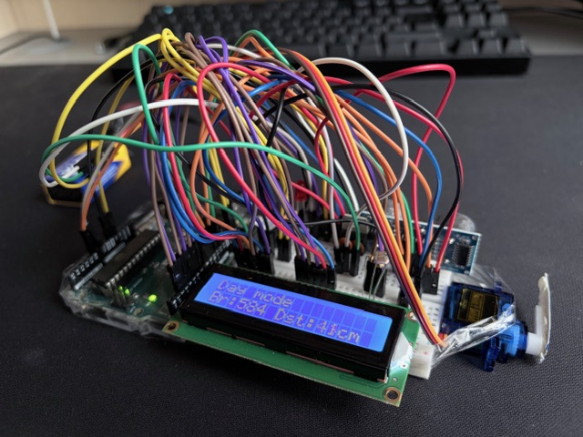

# Security system with day and night mode

Arduino project that switches between **day** and **night** mode. It warns user in case of movement detected or gives distance and brightness data during day or night. If the system detects movement, **buzzer** will start working and red **diode** will start flashing. **LCD** displays different information in every different mode.

## Components used:

* Arduino Uno
* Breadboard
* Micro servo with self-made marker
* distance sensor HC-SR04
* tact switch
* photoresistor
* ceramic capacitor 2x
* linear voltage regulator LM7805
* resistor 1000 Ohm 1x
* resistor 330 Ohm 2x
* blue and red LED
* buzzer
* LCD display
* potentiometer to regulate LCD contrast

## Features and how it works

System switches between day and night mode automatically thanks to the use of photoresistor.

**Day mode:**
Servo in 0° (sleep) position, both LED off, LCD displays information about actual mode, distance from ultrasonic sensor and light intensity from photoresistor.

**Night mode:**

You can toggle between info and alarm mode by pressing tact switch, default mode is the alarm mode.

* info mode: same as day mode but LCD displays "night mode" message.
* alarm mode: servo in 90° (standby) position, blue LED on (standby mode signal), LCD displays information about no movement detected. If sensor detects movement, red diode will start flashing and buzzer will start working. LCD displays information about movement detected.

## Project photo

## How to use

1. Build your own system
2. Connect your Arduino Uno to your PC and 9V battery
3. Check all pin connections and change defined pins in code if needed
4. Run code and test device

## Author

*yungtom0*

